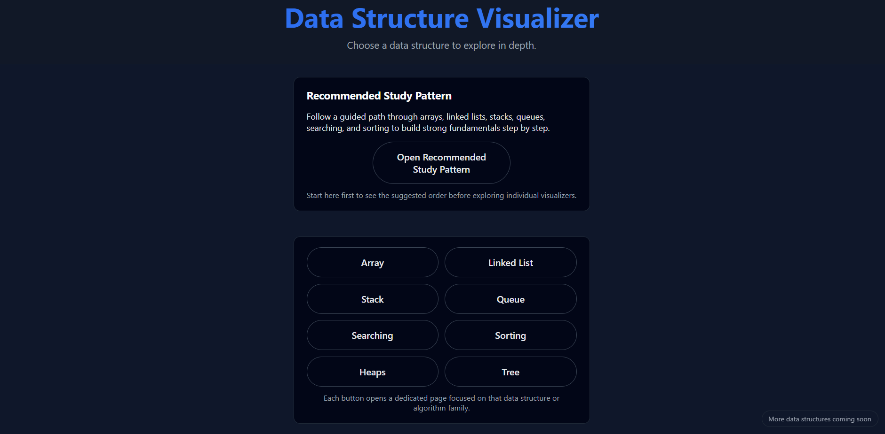

# data-structure-visualizer
Interactive data structure visualizer with step-by-step animations
=======
# 📊 Data Structure Visualizer

🔗 **Live Demo:** https://datastructure-visualizer.firebaseapp.com/  
📘 **Learning Path:** https://datastructure-visualizer.firebaseapp.com/pattern.html  

An interactive, web-based **Data Structure Visualizer** designed to help beginners understand
core data structures and algorithms through **step-by-step, rewindable visualizations**
and a **guided learning path**.

This project focuses on *how and why* data structures change internally, not just the final result.

---

## 🎯 Problem Statement

Many students struggle with Data Structures because concepts are taught abstractly through
code and theory, making it difficult to build intuition for internal behavior such as:

- how elements move during sorting
- how trees rebalance themselves
- why certain operations fail due to constraints
- how different structures behave under the same operation

This problem is especially common among **first-year students and learners without a prior
computer science background**.

---
## 📸 Screenshots

### Home & Learning Path


### Array Visualizer


### Sorting Algorithm Animation


### Balanced Tree Visualization


## 💡 Solution

This project solves that gap by providing:
- visual representations of internal states
- step-by-step execution with **Play, Pause, and Rewind**
- clear explanations tied to each step
- enforced constraints with visual feedback
- a **recommended learning order** for better conceptual flow

---

## ✨ Key Features

- 🔄 **Step-by-step execution** with rewind support  
- 👀 **Clear visual animations** tied to logical operations  
- ❌ **Constraint-aware behavior** (e.g., array overflow shown visually)  
- 🧭 **Guided learning path** for beginners  
- 📱 **Responsive design** (works on desktop and mobile)  
- ⚡ **Fast and lightweight** with no setup required  

---

## 🧱 Data Structures & Algorithms Covered

### Linear Structures
- Array  
- Stack  
- Queue (Linear, Circular, Priority)  
- Linked List (Singly, Doubly, Circular variants)

### Searching
- Linear Search  
- Binary Search  

### Sorting Algorithms
- Bubble Sort  
- Selection Sort  
- Insertion Sort  
- Merge Sort  
- Quick Sort  
- Heap Sort  
- Counting Sort  
- Radix Sort  
- Shell Sort  

### Trees
- Tree Basics  
- Binary Search Tree (BST)  
- AVL Tree  
- Red-Black Tree  

### Heaps
- Min Heap  
- Max Heap  
- Heapify process  

Each visualizer allows users to control execution and observe internal state changes clearly.

---

## 🧠 Recommended Learning Flow

The project includes a dedicated **Learning Path** that suggests an optimal order:

Array → Searching → Sorting → Stack & Queue → Linked Lists → Trees → Heaps

This helps learners build intuition progressively instead of jumping between unrelated topics.

---

## 🛠️ Tech Stack

- **Frontend:** HTML, CSS, JavaScript  
- **Hosting (Google Technology):** Firebase Hosting  

Firebase Hosting is used to deploy the application on **Google infrastructure**, ensuring fast,
secure, and scalable access via a public URL without requiring any setup from users.

---

## 🌍 Impact

- Helps beginners visualize abstract DSA concepts  
- Useful for first-year CS students and self-learners  
- Supports exam and interview preparation  
- Encourages understanding over memorization  

---

## 🚀 Local Setup

```bash
git clone https://github.com/GagandeepSingh33/data-structure-visualizer.git
cd DataStructureVisualizer
open index.html

